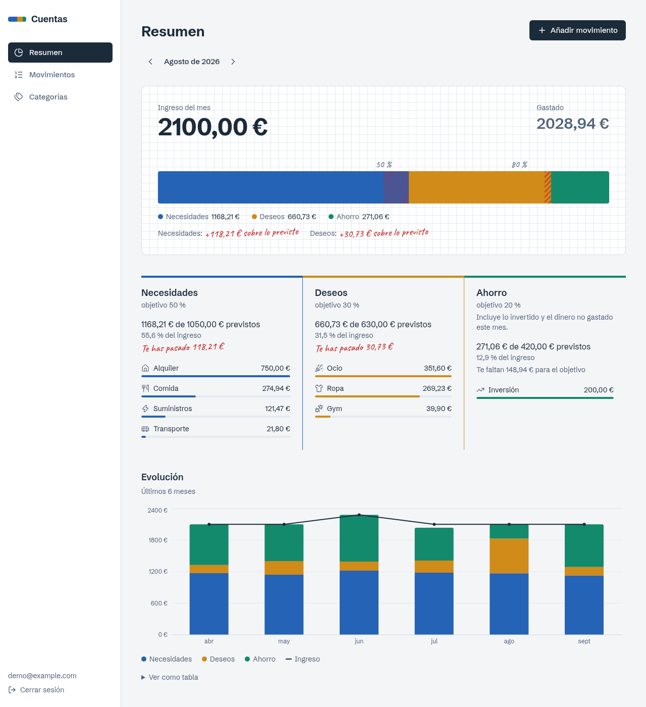
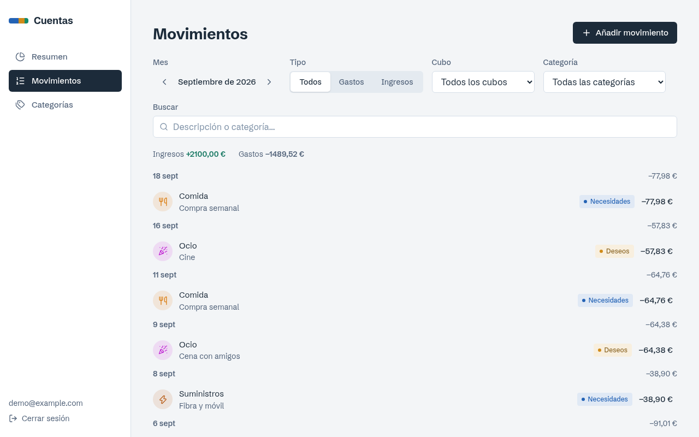
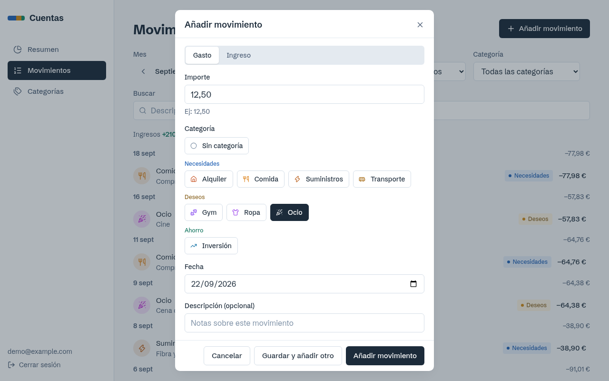
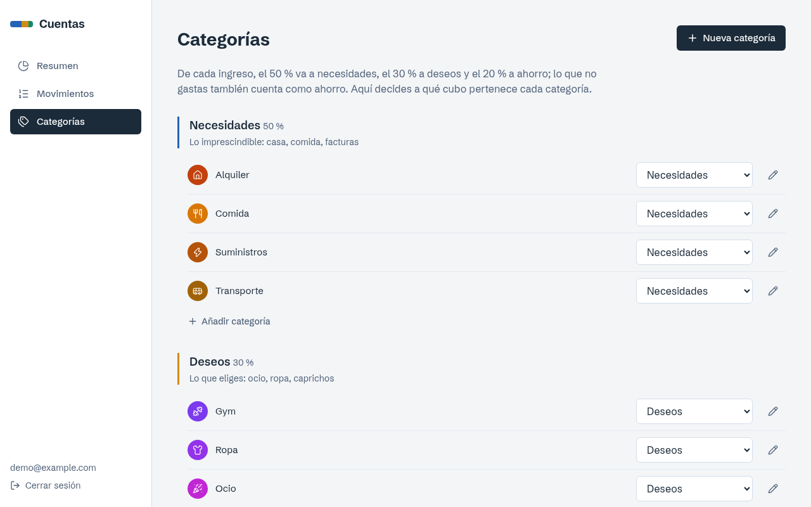
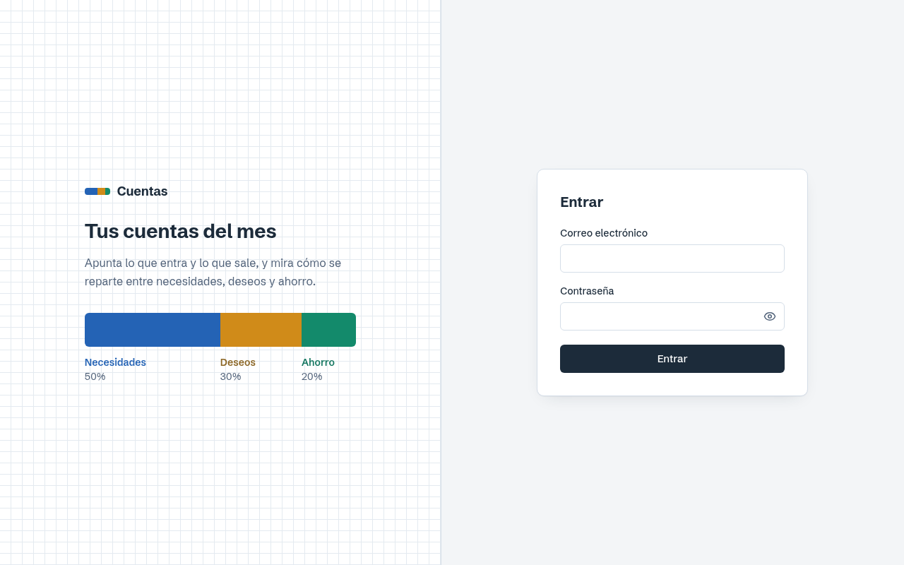
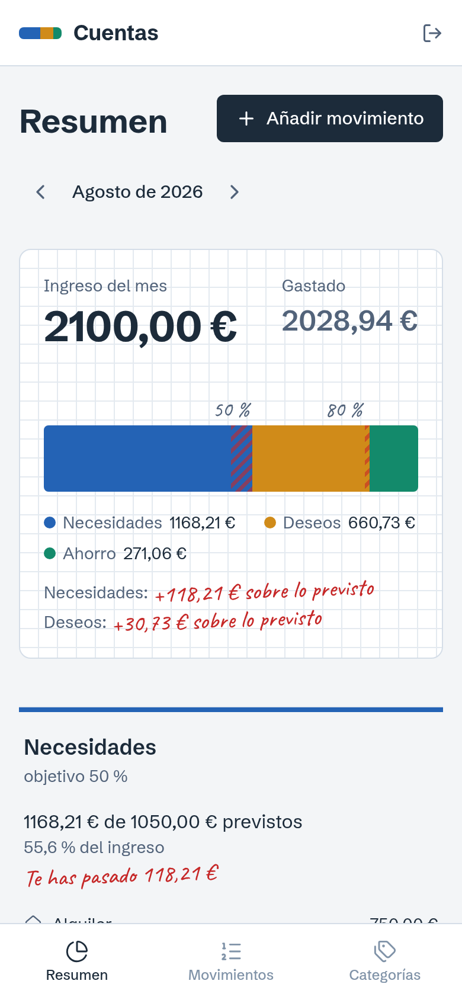
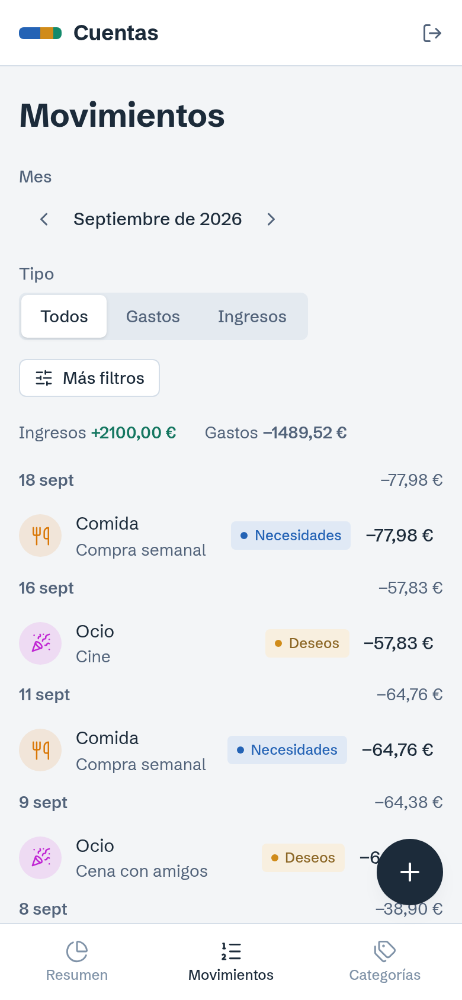

# Cuentas

Aplicación web de finanzas personales basada en la **regla 50/30/20**. Apuntas lo que entra y
lo que sale, y la app calcula cómo se reparte tu dinero entre **necesidades (50 %)**,
**deseos (30 %)** y **ahorro (20 %)**. Te avisa cuando una parte se pasa de su objetivo.



<sub>Todas las capturas usan una cuenta y unos datos de demostración ficticios.</sub>

## Qué hace

- **Reparto del mes.** Tus ingresos del mes se dibujan como una barra dividida con las marcas
  del objetivo 50/30/20, y encima lo que realmente destinaste a cada parte. Si una parte se
  pasa, el exceso sale rayado y con una anotación a mano en rojo, como una corrección en una
  libreta.
- **Detalle por cubo.** Cuánto llevas frente a lo previsto, cuánto te queda o cuánto te has
  pasado, y en qué categorías se va el dinero.
- **Evolución.** Los últimos meses en barras apiladas, con la línea de ingresos encima.
- **Movimientos.** Alta rápida (escribes `12,50`, eliges una categoría y pulsas Enter), filtros
  por mes, tipo, cubo, categoría y texto, y una lista agrupada por días con subtotales.
- **Categorías editables.** Vienen de serie alquiler, comida, suministros, transporte, gym,
  ropa, ocio e inversión, además de nómina y extras como ingresos. Puedes cambiar el cubo de
  cualquiera en el sitio (¿el gym es una necesidad o un deseo? lo decides tú), crear nuevas
  con su icono y color, y archivar o borrar.
- **Acceso con cuenta.** Es una app de un solo usuario: la primera cuenta que se registra es la
  única, y después el registro se cierra.
- **Adaptada a móvil.** Barra de navegación inferior, alta de movimientos a un toque y filtros
  plegables.

| Movimientos | Añadir un movimiento | Categorías |
|---|---|---|
|  |  |  |

| Acceso | Móvil: resumen | Móvil: movimientos |
|---|---|---|
|  |  |  |

## Cómo se calcula el 50/30/20

- La base son los **ingresos del mes**. Los tres objetivos se calculan en céntimos enteros y
  suman exactamente el ingreso: si ingresas 10,01 €, los objetivos son 5,00 € + 3,00 € + 2,01 €.
- Cada gasto va al cubo de su categoría.
- **El ahorro incluye lo que no gastas**:
  `ahorro = gastos en categorías de ahorro (inversión…) + max(0, ingresos − todos los gastos)`.
  Si solo contara lo que apuntas como inversión, alguien que ahorra sin registrarlo aparecería
  con un 0 % de ahorro, y eso sería falso. En el mes en curso la app avisa de que esta cifra
  irá bajando hasta fin de mes.
- Los gastos sin categoría no cuentan en ningún cubo, pero sí reducen el ahorro.
- Todo el dinero se guarda como **enteros de céntimos**, nunca como decimales en coma flotante,
  para que no haya errores de redondeo.

El contrato completo de la API, con la semántica de cada campo, está en [`docs/API.md`](docs/API.md).

## Stack

| Parte    | Tecnología |
|----------|------------|
| Frontend | Vite 8, React 19, TypeScript, Tailwind CSS v4, TanStack Query, Recharts, lucide |
| Backend  | Rust, axum 0.8, sqlx 0.9 (consultas en tiempo de ejecución, sin necesidad de BD al compilar), tokio |
| Datos    | PostgreSQL 18 en un contenedor de podman; las migraciones se aplican al arrancar |
| Sesión   | JWT en cookie `httpOnly` + `SameSite=Lax`; contraseñas con Argon2id |

El frontend habla con el backend a través del proxy de Vite (`/api`), así que para el navegador
todo es el mismo origen: la cookie de sesión funciona sin CORS y el token nunca está al
alcance de JavaScript.

## Cómo se construyó

1. **Contrato primero.** Antes de escribir funcionalidad se fijaron el contrato de la API
   ([`docs/API.md`](docs/API.md)), el esquema SQL y un núcleo compartido: errores, sesión,
   modelo de dominio, tokens de diseño, cliente de API y primitivas de UI. El núcleo se verificó
   compilando y aplicando las migraciones contra Postgres.
2. **Módulos en paralelo.** Con el contrato fijado, cada parte se desarrolló de forma
   independiente en su propia rama, con ficheros propios para que no hubiera conflictos. En el
   backend: autenticación, categorías con movimientos y el resumen 50/30/20. En el frontend:
   acceso, resumen, movimientos y categorías.
3. **Integración y verificación reales.** Tras fusionar las ramas se probó todo de punta a
   punta contra Postgres y en un navegador de verdad. Eso destapó fallos que las pruebas
   aisladas no veían:
   - La librería de JWT compilaba sin avisos pero **hacía panic al firmar el primer token**
     porque le faltaba el backend criptográfico.
   - Enter no enviaba el formulario de alta, porque el botón quedaba fuera del `<form>`.
   - Los colores de Necesidades y Deseos eran **casi indistinguibles con daltonismo de tipo
     protanopía** (ΔE 3,0). La paleta se rehízo y se validó (ΔE ≥ 11), y el texto se separó en
     variantes con contraste AA.
   - La evolución dibujaba **una caída falsa a 0 €** en los meses anteriores al primer
     movimiento.
   - La fuente separaba la coma decimal de las cifras ("2100 , 00 €").

La prueba de punta a punta de la API está en [`scripts/e2e.py`](scripts/e2e.py): 46
comprobaciones, con las cifras del 50/30/20 calculadas a mano. El backend tiene además 50 tests
unitarios.

## Arrancar en local

Requisitos: Rust ≥ 1.94, Node ≥ 20 y podman.

```bash
cp .env.example .env
openssl rand -base64 48     # pega el resultado en JWT_SECRET dentro de .env
./scripts/dev.sh            # BD (podman) + backend (:8080) + frontend (:5173)
```

Abre http://localhost:5173 y crea tu cuenta.

| Comando | Qué hace |
|---|---|
| `./scripts/db.sh {up\|down\|status\|logs\|psql\|reset}` | Gestiona la BD de desarrollo |
| `cd backend && cargo test` | Tests unitarios del backend |
| `python3 scripts/e2e.py` | Prueba de punta a punta (solo sobre una BD **sin** usuario) |
| `cd frontend && npx tsc -b && npx oxlint src` | Tipos y lint del frontend |

## Seguridad

- Contraseñas con Argon2id, de 12 caracteres como mínimo.
- La sesión va en una cookie `httpOnly`, así que un script inyectado no puede leerla.
- Toda consulta se filtra por usuario; un recurso ajeno responde 404, no 403.
- Tras 10 intentos fallidos con un mismo email, ese email se bloquea 15 minutos. Consecuencia
  asumida: quien conozca tu email podría bloquearte el acceso durante ese rato.
- Para exponerla fuera de tu máquina hace falta HTTPS delante y `COOKIE_SECURE=true`. Sin HTTPS,
  la contraseña y la cookie viajarían en claro.

## Estructura

```
backend/
  src/auth/          registro, login, sesión, límite de intentos
  src/categories/    CRUD de categorías
  src/transactions/  CRUD de movimientos con filtros y paginación
  src/summary/       cálculo 50/30/20 (lógica pura en calc.rs, con tests) y consultas
  migrations/        esquema SQL
frontend/
  src/pages/         una carpeta por pantalla
  src/components/    primitivas de UI compartidas
  src/lib/           cliente de API, dinero, fechas, cubos, iconos, sesión
  src/styles/        tokens de diseño
docs/                contrato de API y capturas
scripts/             base de datos, arranque y prueba de punta a punta
```
